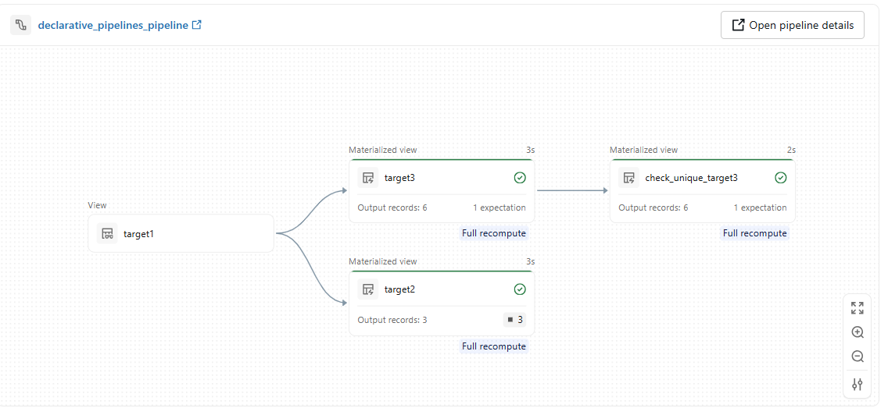

# declarative_pipelines

A meta-driven Databricks Declarative Pipeline framework. Instead of hardcoding pipeline logic, transformation steps are configured in a Delta table (Unity Catalog) and executed dynamically at runtime.

## Quickstart

> **Precondition:** Databricks CLI configured with a `DEFAULT` profile.

### 1. Install dependencies

```bash
uv sync --group dbc
```

### 2. Seed test data and config

Create the source tables and write the example pipeline config to the config table. 
Make sure to update the catalog, schema and table names in the test_data script and test_config.

```bash
uv run python scripts/create_test_data.py
uv run python scripts/create_test_config.py
```

### 3. Configure `databricks.yml`

Update the [`databricks.yml`](databricks.yml) (search for "TODO")


### 4. Deploy

```bash
databricks bundle deploy -t dev
```

The wheel is built automatically via `uv build --wheel` before upload.

### 5. Run the pipeline

```bash
databricks bundle run declarative_pipelines_job -t dev
```

This should then result in something like this:


---

## How it works

At runtime the pipeline entry point reads a config table, deserializes each step, and registers the corresponding Databricks Declarative Pipeline datasets (tables, materialized views, temporary views) and quality expectations dynamically.

```
Config table (Delta)
      │
      ▼
 run_pipeline()         ← entry point; reads config table
      │
      ▼
 load_steps()          ← filters by pipeline_id, deserializes steps
      │
      ▼
 create_transformation_step()   ← resolves function, applies dp.* decorators
      │
      ▼
 Databricks Declarative Pipeline datasets registered
```

---

## Config table schema

One row per `pipeline_id`. Each row contains an array of `steps`, where each step defines sources, a transformation function, and a target dataset.

| Field | Type | Description |
|---|---|---|
| `pipeline_id` | STRING | Unique identifier for the pipeline |
| `pipeline_name` | STRING | Human-readable name |
| `pipeline_description` | STRING | Optional description |
| `steps` | ARRAY | Ordered list of transformation steps |

Each step:

| Field | Type | Description |
|---|---|---|
| `steps[].sources` | ARRAY | Source tables to read (`fully_qualified_name`, `alias`) |
| `steps[].transformation.transformation_id` | STRING | Registered function name |
| `steps[].transformation.kwargs` | STRING | JSON-encoded keyword arguments forwarded to the function |
| `steps[].target.target_type` | STRING | `table`, `materialized_view`, or `temporary_view` |
| `steps[].target.fully_qualified_name` | STRING | 3-part name for tables/MVs; plain name for temp views |
| `steps[].target.comment` | STRING | Optional dataset comment (not supported for `temporary_view`) |
| `steps[].target.schema` | STRING | Optional DDL string (e.g. `col1 STRING COMMENT '...'`); not supported for `temporary_view` |
| `steps[].target.expectations` | ARRAY | Quality rules (`expectation_type`, `name`, `condition`) |

---

## Config table example

```python
data = [
    (
        "pipeline_001",
        "My Pipeline",
        "Processes raw data into gold layer.",
        [
            {
                "sources": [
                    {"fully_qualified_name": "catalog.bronze.source_table", "alias": "df"},
                ],
                "transformation": {
                    "transformation_id": "my_transformation",
                    "kwargs": '{"threshold": 10}',
                },
                "target": {
                    "target_type": "materialized_view",
                    "fully_qualified_name": "catalog.gold.output_table",
                    "comment": "Gold layer output",
                    "schema": "id STRING, value INT",
                    "expectations": [
                        {"expectation_type": "expect_or_fail", "name": "value positive", "condition": "value > 0"},
                    ],
                },
            }
        ],
    )
]
```

See [`scripts/create_test_config.py`](scripts/create_test_config.py) for a full working example.

---
